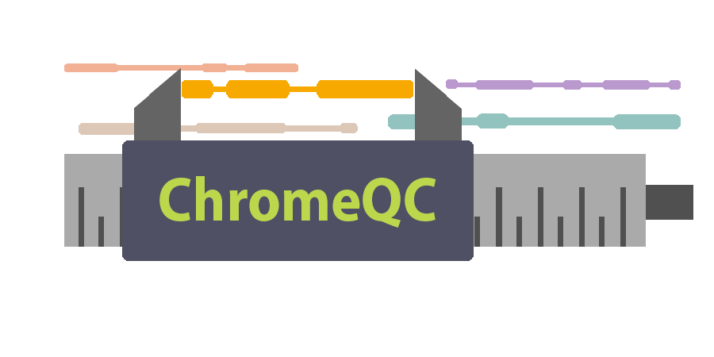

# ChromeQC: Summarize library quality of 10x Genomics Chromium linked reads

This tool provides a quick report on the quality of a 10x Genomics Chromium linked reads library. The report summarizes the sizes of the molecules, the number of reads per molecule, the number of molecules per barcode, and the amount of DNA per barcode. The idea is to provide a [FastQC](https://www.bioinformatics.babraham.ac.uk/projects/fastqc/)-like tool in terms of speed but to contain information provided by the Summary page of the [Loupe software of 10x Genomics](https://support.10xgenomics.com/genome-exome/software/visualization/latest/what-is-loupe). ChromeQC is developed in Python 3, R, AWK, RMarkdown, and Flexdashboard, and uses BWA-MEM for read alignment.

# Usage

```
-w --whitelist     : default='whitelist_barcodes', type=str
-k --subsample_size: default=4000                , type=int
-i --in            : default='-'                 , type=str
-o --out           : default='stdout'            , type=str
-s --seed          : default=1334                , type=int
-m --max_read_pairs: default=-1                  , type=int  , note: -1 means all read pairs
-p --stats_out_path: default='.'                 , type=str  , note: the directory needs to be created already
-v --verbose       : default=False               , no value  , note: If supplied, will be set to true, else will be false.
```

# Examples

+ [Sample ChromeQC report](https://hackseq.github.io/2017_project_6/report/)
+ [Sample MultiQC report](https://hackseq.github.io/2017_project_6/multiqc/)

```sh
python3 random_sampling_from_whitelist.py -w ../data/whitelist_barcodes.txt.gz -i ../data/read-RA_si-GAGTTAGT_lane-001-chunk-0002.fastq.gz -v
```

The pipeline starts with raw FASTQ files of interleaved paired end reads provided by the 10x Chromium platform.

# Dependencies

```sh
pip3 install -r requirements.txt
brew bundle
```

+ BWA or Minimap2
+ Pysam
+ Python 3
+ Samtools

# Prerequisites

The analysis and report will be created using R, the Tidyverse, RMarkdown, and Flexdashboard. Familiarity with some of these tools is useful, but not necessary to participate in this project. Non-technical participants are welcome to design the aesthetics of the report, prepare and deliver the presentation, and coordinate writing a brief paper about the tool.

Team Lead: [Shaun Jackman](http://sjackman.ca) | sjackman@gmail.com | @sjackman | Grad Student | BC Cancer Agency Genome Sciences Centre
